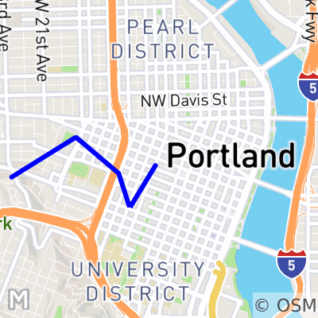
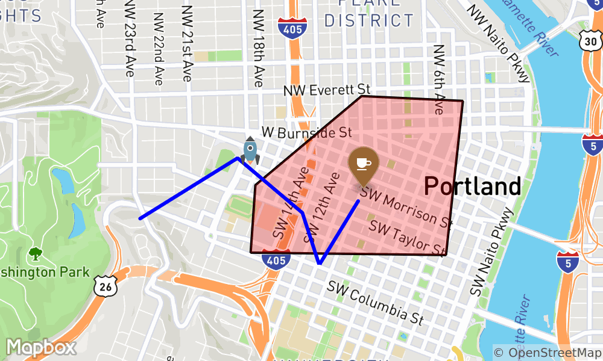

# MapboxStatic

[📱&nbsp;](https://www.bitrise.io/app/faa9d29af3e2ce7a) &nbsp;&nbsp;&nbsp;
[🖥💻&nbsp;](https://www.bitrise.io/app/5f8ae2a3885d8173) &nbsp;&nbsp;&nbsp;
[📺&nbsp;](https://www.bitrise.io/app/76cb1d11414a5b80) &nbsp;&nbsp;&nbsp;
[⌚️&nbsp;](https://www.bitrise.io/app/cd7bcec99edcea34)

MapboxStatic.swift makes it easy to connect your iOS, OS X, tvOS, or watchOS application to the [classic Mapbox Static API](https://www.mapbox.com/api-documentation/#static-classic). Quickly generate a static map image with overlays by fetching it synchronously or asynchronously over the Web using first-class Swift or Objective-C data types.

Static maps are flattened PNG or JPG images, ideal for use in table views, image views, and anyplace else you'd like a quick, custom map without the overhead of an interactive view. They are created in one HTTP request, so overlays are all added *server-side*.

MapboxStatic.swift pairs well with [MapboxDirections.swift](https://github.com/mapbox/MapboxDirections.swift), [MapboxGeocoder.swift](https://github.com/mapbox/MapboxGeocoder.swift), and the [Mapbox iOS SDK](https://www.mapbox.com/ios-sdk/) or [OS X SDK](https://github.com/mapbox/mapbox-gl-native/tree/master/platform/osx).

## Installation 

Embed `MapboxStatic.framework` into your application target, then `import MapboxStatic` or `@import MapboxStatic;`. Alternatively, specify the following dependency in your [CocoaPods](http://cocoapods.org/) Podfile:

```podspec
pod 'MapboxStatic.swift', :git => 'https://github.com/mapbox/MapboxStatic.swift.git', :tag => 'v0.6.0'
```

## Usage

You will need a [map ID](https://www.mapbox.com/help/define-map-id/) from a [custom map style](https://www.mapbox.com/help/customizing-the-map/) on your Mapbox account. You will also need an [access token](https://www.mapbox.com/developers/api/#access-tokens) in order to use the API. 

### Basics

The main static map class is `Snapshot` in Swift or `MBSnapshot` in Objective-C. To create a basic snapshot, create a `SnapshotOptions` or `MBSnapshotOptions` object, specifying the center coordinates, [zoom level](https://www.mapbox.com/help/how-web-maps-work/#tiles-and-zoom-levels), and point size:

```swift
// main.swift
import MapboxStatic

let options = SnapshotOptions(
    mapIdentifiers: ["<#your map ID#>"],
    centerCoordinate: CLLocationCoordinate2D(latitude: 45.52, longitude: -122.681944),
    zoomLevel: 13,
    size: CGSize(width: 200, height: 200))
let snapshot = Snapshot(
    options: options,
    accessToken: "<#your access token#>")
```

```objc
// main.m
@import MapboxStatic;

MBSnapshotOptions *options = [[MBSnapshotOptions alloc] initWithMapIdentifiers:@[@"<#your map ID#>"]
                                                              centerCoordinate:CLLocationCoordinate2DMake(45.52, -122.681944)
                                                                     zoomLevel:13
                                                                          size:CGSizeMake(200, 200)];
MBSnapshot *snapshot = [[MBSnapshot alloc] initWithOptions:options accessToken:@"<#your access token#>"];
```

Then, you can either retrieve an image synchronously (blocking the calling thread):

```swift
// main.swift
imageView.image = snapshot.image
```

```objc
// main.m
imageView.image = snapshot.image;
```


Or you can pass a completion handler to update the UI thread after the image is retrieved:

```swift
// main.swift
snapshot.image { (image, error) in
    imageView.image = image
}
```

```objc
// main.m
[snapshot imageWithCompletionHandler:^(UIImage * _Nullable image, NSError * _Nullable error) {
    imageView.image = image;
}];
```

If you're using your own HTTP library or routines, you can also retrieve a snapshot’s `requestURL` property.

```swift
// main.swift
let requestURLToFetch = snapshot.requestURL
```

```objc
// main.m
NSURL *requestURLToFetch = snapshot.requestURL;
```

### Overlays

Overlays are where things get interesting! You can add [Maki markers](https://www.mapbox.com/maki/), custom marker imagery, GeoJSON geometries, and even paths made of bare coordinates. 

You add overlays to the `overlays` field in the `SnapshotOptions` or `MBSnapshotOptions` object. Here are some versions of our snapshot with various overlays added. 

#### Marker

```swift
// main.swift
let markerOverlay = Marker(
    coordinate: CLLocationCoordinate2D(latitude: 45.52, longitude: -122.681944),
    size: .Medium,
    iconName: "cafe"
)
markerOverlay.color = .brownColor()
```

```objc
// main.m
MBMarker *markerOverlay = [[MBMarker alloc] initWithCoordinate:CLLocationCoordinate2DMake(45.52, -122.681944)
                                                          size:MBMarkerSizeMedium
                                                      iconName:@"cafe"];
#if TARGET_OS_IOS || TARGET_OS_TV || TARGET_OS_WATCH
    markerOverlay.color = [UIColor brownColor];
#elif TARGET_OS_MAC
    markerOverlay.color = [NSColor brownColor];
#endif
```


#### Custom marker

```swift
// main.swift
let customMarker = CustomMarker(
    coordinate: CLLocationCoordinate2D(latitude: 45.522, longitude: -122.69),
    URL: NSURL(string: "https://www.mapbox.com/help/img/screenshots/rocket.png")!
)
```

```objc
// main.m
MBCustomMarker *customMarker = [[MBCustomMarker alloc] initWithCoordinate:CLLocationCoordinate2DMake(45.522, -122.69)
                                                                      URL:[NSURL URLWithString:@"https://www.mapbox.com/help/img/screenshots/rocket.png"]];
```


#### GeoJSON

```swift
// main.swift
let geojsonOverlay: GeoJSON

do {
    let geojsonURL = NSURL(string: "http://git.io/vCv9U")!
    let geojsonString = try NSString(contentsOfURL: geojsonURL, encoding: NSUTF8StringEncoding)
    geojsonOverlay = GeoJSON(objectString: geojsonString as String)
}
```

```objc
// main.m
NSURL *geojsonURL = [NSURL URLWithString:@"http://git.io/vCv9U"];
NSString *geojsonString = [[NSString alloc] initWithContentsOfURL:geojsonURL
                                                         encoding:NSUTF8StringEncoding
                                                            error:NULL];
MBGeoJSON *geojsonOverlay = [[MBGeoJSON alloc] initWithObjectString:geojsonString];
```



#### Path

```swift
// main.swift
let path = Path(
    coordinates: [
        CLLocationCoordinate2D(
            latitude: 45.52475063103141, longitude: -122.68209457397461
        ),
        CLLocationCoordinate2D(
            latitude: 45.52451009822193, longitude: -122.67488479614258
        ),
        CLLocationCoordinate2D(
            latitude: 45.51681250530043, longitude: -122.67608642578126
        ),
        CLLocationCoordinate2D(
            latitude: 45.51693278828882, longitude: -122.68999099731445
        ),
        CLLocationCoordinate2D(
            latitude: 45.520300607576864, longitude: -122.68964767456055
        ),
        CLLocationCoordinate2D(
            latitude: 45.52475063103141, longitude: -122.68209457397461
        )
    ]
)
path.strokeWidth = 2
path.strokeColor = .blackColor()
path.fillColor = .redColor()
path.fillOpacity = 0.25
```

```objc
// main.m
CLLocationCoordinate2D coordinates[] = {
    CLLocationCoordinate2DMake(45.52475063103141, -122.68209457397461),
    CLLocationCoordinate2DMake(45.52451009822193, -122.67488479614258),
    CLLocationCoordinate2DMake(45.51681250530043, -122.67608642578126),
    CLLocationCoordinate2DMake(45.51693278828882, -122.68999099731445),
    CLLocationCoordinate2DMake(45.520300607576864, -122.68964767456055),
    CLLocationCoordinate2DMake(45.52475063103141, -122.68209457397461),
};
MBPath *path = [[MBPath alloc] initWithCoordinates:coordinates
                                             count:sizeof(coordinates) / sizeof(coordinates[0])];
path.strokeWidth = 2;
#if TARGET_OS_IOS || TARGET_OS_TV || TARGET_OS_WATCH
    path.strokeColor = [UIColor blackColor];
    path.fillColor = [UIColor redColor];
#elif TARGET_OS_MAC
    path.strokeColor = [NSColor blackColor];
    path.fillColor = [NSColor redColor];
#endif
path.fillOpacity = 0.25;
```


### Other options

#### Auto-fitting features

If you’re adding overlays to your map, leave out the center coordinate and zoom level to automatically calculate the center and zoom level that best shows them off.

```swift
// main.swift
var options = SnapshotOptions(
    mapIdentifiers: ["<#your map ID#>"],
    size: CGSize(width: 500, height: 300))
options.overlays = [path, geojsonOverlay, markerOverlay, customMarker]
```

```objc
// main.m
MBSnapshotOptions *options = [[MBSnapshotOptions alloc] initWithMapIdentifiers:@[@"<#your map ID#>"]
                                                                          size:CGSizeMake(500, 300)];
options.overlays = @[path, geojsonOverlay, markerOverlay, customMarker];
```



#### Standalone markers
 
Use the `MarkerOptions` class to get a standalone marker image, which can be useful if you’re trying to composite it atop a map yourself.

```swift
// main.swift
let options = MarkerOptions(
    size: .Medium,
    iconName: "cafe")
options.color = .brownColor()
let snapshot = Snapshot(
    options: options,
    accessToken: "<#your access token#>")
```

```objc
// main.m
MBMarkerOptions *options = [[MBMarkerOptions alloc] initWithSize:MBMarkerSizeMedium
                                                        iconName:@"cafe"];
#if TARGET_OS_IOS || TARGET_OS_TV || TARGET_OS_WATCH
    options.color = [UIColor brownColor];
#elif TARGET_OS_MAC
    options.color = [NSColor brownColor];
#endif
MBSnapshot *snapshot = [[MBSnapshot alloc] initWithOptions:options
                                               accessToken:@"<#your access token#>"];
```

#### File format and quality

When creating a map, you can also specify PNG or JPEG image format as well as various [bandwidth-saving image qualities](https://www.mapbox.com/api-documentation/#retrieve-a-static-map-image).

#### Attribution

Be sure to [attribute your map](https://www.mapbox.com/help/attribution/) properly in your application. You can also [find out more](https://www.mapbox.com/about/maps/) about where Mapbox’s map data comes from.

### Tests

To run the included unit tests, you need to use [CocoaPods](http://cocoapods.org) to install the dependencies. 

1. `pod install`
1. `open MapboxStatic.xcworkspace`
1. `Command+U` or `xcodebuild test`

### More info

This repository includes an example iOS application written in Swift, as well as Swift playgrounds for iOS and OS X. (Open the playgrounds inside of MapboxStatic.xcworkspace.) More examples are available in the [Mapbox API Documentation](https://www.mapbox.com/api-documentation/?language=Swift#static-classic).
