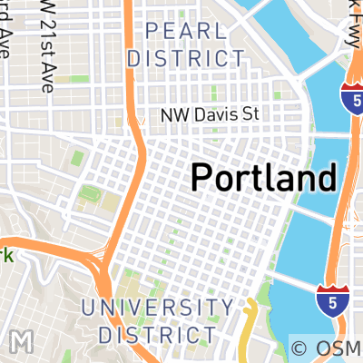
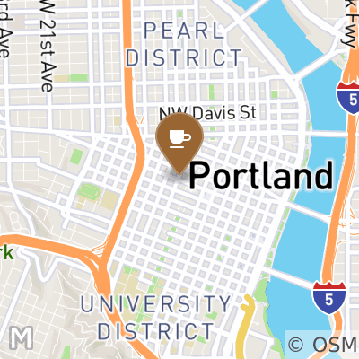
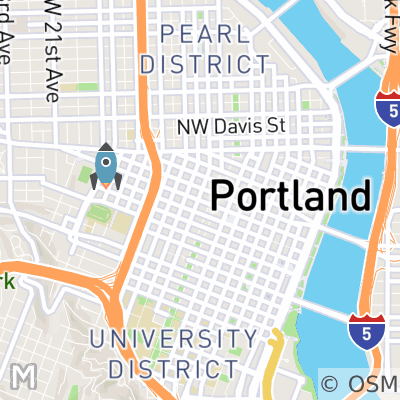
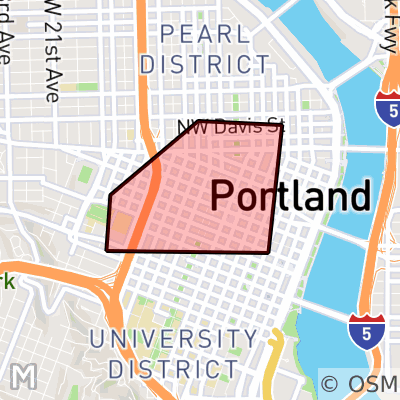

# MapboxStatic

[📱&nbsp;](https://www.bitrise.io/app/faa9d29af3e2ce7a) &nbsp;&nbsp;&nbsp;
[🖥&nbsp;](https://www.bitrise.io/app/5f8ae2a3885d8173)

MapboxStatic.swift makes it easy to connect your iOS, OS X, tvOS, or watchOS application to the [classic Mapbox Static API](https://www.mapbox.com/api-documentation/#static-classic). Quickly generate a static map image with overlays, asynchronous imagery fetching, and first-class Swift data types.

Static maps are flattened PNG or JPG images, ideal for use in table views, image views, and anyplace else you'd like a quick, custom map without the overhead of an interactive view. They are created in one HTTP request, so overlays are all added *server-side*.

MapboxStatic.swift pairs well with [MapboxDirections.swift](https://github.com/mapbox/MapboxDirections.swift), [MapboxGeocoder.swift](https://github.com/mapbox/MapboxGeocoder.swift), and the [Mapbox iOS SDK](https://www.mapbox.com/ios-sdk/) or [OS X SDK](https://github.com/mapbox/mapbox-gl-native/tree/master/platform/osx).

## Installation 

Embed `MapboxStatic.framework` into your application target, then `import MapboxStatic` or `@import MapboxStatic;`. Alternatively, specify the following dependency in your [CocoaPods](http://cocoapods.org/) Podfile:

```podspec
pod 'MapboxStatic.swift', :git => 'https://github.com/mapbox/MapboxStatic.swift.git', :branch => 'master'
```

## Usage

You will need a [map ID](https://www.mapbox.com/foundations/glossary/#mapid) from a [custom map style](https://www.mapbox.com/foundations/customizing-the-map) on your Mapbox account. You will also need an [access token](https://www.mapbox.com/developers/api/#access-tokens) in order to use the API. 

### Basics

The main static map class is `Snapshot`. To create a basic snapshot, create a `SnapshotOptions` object, specifying the center coordinates, [zoom level](https://www.mapbox.com/guides/how-web-maps-work/#tiles-and-zoom-levels), and point size:

```swift
import MapboxStatic

let options = SnapshotOptions(
    mapIdentifiers: ["<#your map ID#>"],
    centerCoordinate: CLLocationCoordinate2D(latitude: 45.52, longitude: -122.681944),
    zoomLevel: 13,
    size: CGSize(width: 200, height: 200))
let snapshot = Snapshot(
    options: options,
    accessToken: "<#your access token#>")
```

Then, you can either retrieve an image synchronously (blocking the calling thread):

```swift
imageView.image = snapshot.image
```



Or you can pass a completion handler to update the UI thread after the image is retrieved:

```swift
snapshot.image { (image, error) in
    imageView.image = image
}
```

If you're using your own HTTP library or routines, you can also retrieve a snapshot’s `requestURL` property.

```swift
let requestURLToFetch = snapshot.requestURL
```

### Overlays

Overlays are where things get interesting! You can add [Maki markers](https://www.mapbox.com/maki/), custom marker imagery, GeoJSON geometries, and even paths made of bare coordinates. 

You add overlays to the `overlays` field in the `SnapshotOptions` object. Here are some versions of our snapshot with various overlays added. 

#### Marker

```swift
let markerOverlay = Marker(
    coordinate: CLLocationCoordinate2D(latitude: 45.52, longitude: -122.681944),
    size: .Medium,
    label: "cafe",
    color: .brownColor()
)
```



#### Custom marker

```swift
let customMarker = CustomMarker(
    coordinate: CLLocationCoordinate2D(latitude: 45.522, longitude: -122.69),
    URL: NSURL(string: "https://www.mapbox.com/help/img/screenshots/rocket.png")!
)
```



#### GeoJSON

```swift
let geojsonOverlay: GeoJSON

do {
    let geojsonURL = NSURL(string: "http://git.io/vCv9U")!
    let geojsonString = try NSString(contentsOfURL: geojsonURL, encoding: NSUTF8StringEncoding)
    geojsonOverlay = GeoJSON(string: geojsonString as String)
}
```


#### Path

```swift
let path = Path(
    pathCoordinates: [
        CLLocationCoordinate2D(
            latitude: 45.52475063103141, longitude: -122.68209457397461
        ),
        CLLocationCoordinate2D(
            latitude: 45.52451009822193, longitude: -122.67488479614258
        ),
        CLLocationCoordinate2D(
            latitude: 45.51681250530043, longitude: -122.67608642578126
        ),
        CLLocationCoordinate2D(
            latitude: 45.51693278828882, longitude: -122.68999099731445
        ),
        CLLocationCoordinate2D(
            latitude: 45.520300607576864, longitude: -122.68964767456055
        ),
        CLLocationCoordinate2D(
            latitude: 45.52475063103141, longitude: -122.68209457397461
        )
    ],
    strokeWidth: 2,
    strokeColor: .blackColor(),
    fillColor: .redColor(),
    fillOpacity: 0.25
)
```



### Other options

#### Auto-fitting features

If you’re adding overlays to your map, leave out the center coordinate and zoom level to automatically calculate the center and zoom level that best shows them off.

```swift
var options = SnapshotOptions(
    mapIdentifiers: ["<#your map ID#>"],
    size: CGSize(width: 500, height: 300))
options.overlays = [path, geojsonOverlay, markerOverlay, customMarker]
```


#### File format and quality

When creating a map, you can also specify PNG or JPEG image format as well as various [bandwidth-saving image qualities](https://www.mapbox.com/api-documentation/#retrieve-a-static-map-image).

#### Attribution

Be sure to [attribute your map](https://www.mapbox.com/api-documentation/#static-classic) properly in your app. You can also [find out more](https://www.mapbox.com/about/maps/) about where Mapbox's map data comes from.

### Tests

To run the included unit tests, you need to use [CocoaPods](http://cocoapods.org) to install the dependencies. 

1. `pod install`
1. `open MapboxStatic.xcworkspace`
1. `Command+U` or `xcodebuild test`

### More info

This repository includes an example iOS application written in Swift, as well as Swift playgrounds for iOS and OS X. More examples are available in the [Mapbox API Documentation](https://www.mapbox.com/api-documentation/?language=Swift#static-classic).
